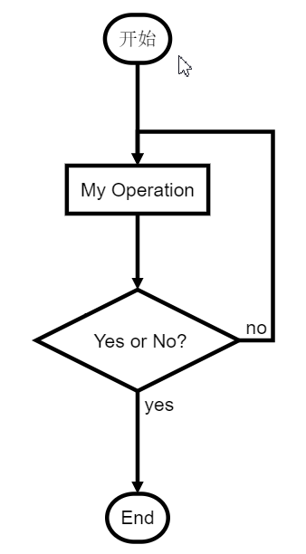

# **Markdown 语法基础**

## 一、标题

一个 # 加空格为一级标题，## 加空格为二级标题，以此类推，最多六级。

## 二、字体

1. 加粗：2个 * 包起来

2. 斜体：1个 * 包起来

3. 斜体加粗：3个 * 包起来

4. 删除线：2个 ~~ 包起来

**注：** 注意后面添加空格

## 三、引用

在引用文字前加 >, 可以嵌套

## 四、分割线

三个或以上的 - 或 * 皆可。

## 五、图片

```text

```

注：alt 属性原为图片无法正常显示时的替代文本，现多用于方便搜索引擎搜索；title 属性为鼠标放在图片上的提示文本。

示例：


**注：** 添加本地图片不支持绝对路径，支持相对路径；alt 和 title 为可选内容。

## 六、超链接

语法：

```text
[超链接名](超链接地址 "超链接title")
```

**注：** 比图片引用格式少了前面的感叹号；title可选。

示例：

[百度](https://baidu.com)

## 七、序列

- 有序列表

  数字加小数点加空格，如“1. 内容”

- 无序列表

  减号或加号或星号加空格，如“- 内容”

- 列表嵌套

  在下一级前面加2个空格
  
## 八、表格

```text
|表头|表头|表头|
|-|:-:|-:|
|内容|内容|内容|
```

**注：**- 两边加冒号表居中，右边加冒号表居右；两边 | 可省略。

显示效果

表头|表头|表头
-|:-:|-:
内容|内容|内容

## 九、代码

**单行代码**：用反引号 ` 包起来

**多行代码**：用 ``` 包起来并注明语言类型

## 十、流程图

用 ``` 把流程图代码包起来并注明flow类型

```flow
st=>start: 开始
op=>operation: My Operation
cond=>condition: Yes or No?
e=>end
st->op->cond
cond(yes)->e
cond(no)->op
```

效果如下(截图)，GitHub不显示流程图

